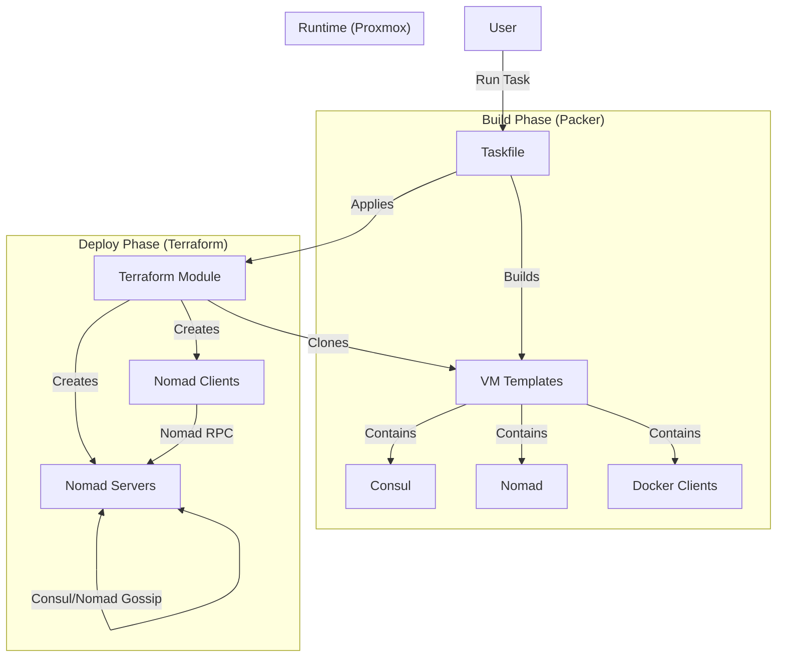

# HashiCorp Homelab with Proxmox

Automated infrastructure-as-code for deploying HashiCorp Nomad clusters on Proxmox VE using Packer and Terraform.

> **⚠️ SECURITY NOTICE**: Never commit credentials to version control. Use Terraform variables or environment variables for sensitive data.

## Features

- 🚀 **Automated VM Templates**: Packer builds Ubuntu templates with HashiCorp tools pre-installed
- 🔧 **HashiCorp Stack**: Consul, Nomad, and Vault ready for cluster deployment
- 🐳 **Container Ready**: Docker pre-installed on Nomad client templates
- 🏗️ **Infrastructure as Code**: Terraform modules for deploying Nomad clusters
- 📦 **Incremental Builds**: Templates build on each other for faster iteration
- 🏠 **Homelab Optimized**: Designed for multi-node Proxmox VE clusters

## Architecture



## Quick Start

### Prerequisites

- Proxmox VE 7.x or later
- [Packer](https://www.packer.io/) 1.9.x or later
- [Terraform](https://www.terraform.io/) 1.5.x or later
- SSH access to Proxmox nodes
- Network with DHCP for initial builds, static IPs for deployment
- [Task](https://taskfile.dev/) (optional, for running defined tasks)

### 1. Build Packer Templates

**Using Task (Recommended):**

```bash
# Build Debian Nomad Client
task build:debian:client

# Build Debian Nomad Server
task build:debian:server
```

**Manual Build:**

```bash
# Build Nomad server template (includes Consul + Nomad)
packer build \
  -var-file="packer/variables/common.pkrvars.hcl" \
  -var-file="packer/variables/proxmox-host1.pkrvars.hcl" \
  -var="proxmox_password=YOUR_PASSWORD" \
  packer/templates/ubuntu/ubuntu-nomad-server.pkr.hcl

# Build Nomad client template (includes Consul + Nomad + Docker)
packer build \
  -var-file="packer/variables/common.pkrvars.hcl" \
  -var-file="packer/variables/proxmox-host1.pkrvars.hcl" \
  -var="proxmox_password=YOUR_PASSWORD" \
  packer/templates/ubuntu/ubuntu-nomad-client.pkr.hcl
```

This creates templates:

- VM 9100: ubuntu-nomad-server (20GB disk, 2GB RAM)
- VM 9101: ubuntu-nomad-client (40GB disk, 4GB RAM)

### 2. Deploy Nomad Cluster with Terraform

```bash
cd terraform/environments/dev

# Initialize Terraform
terraform init

# Review deployment plan
terraform plan -out=tfplan

# Deploy cluster
terraform apply tfplan
```

This deploys:

- 3 Nomad servers (IPs: 10.0.0.50-52)
- 1 Nomad client (IP: 10.0.0.60)
- Consul cluster (co-located on servers)
- All services configured and started

### 3. Verify Cluster

```bash
# SSH to first server
ssh ubuntu@10.0.0.50

# Check Consul cluster
consul members

# Check Nomad cluster
nomad server members
nomad node status
```

Access UIs:

- Consul: <http://10.0.0.50:8500>
- Nomad: <http://10.0.0.50:4646>

## Directory Structure

```plaintext
hashi_homelab/
├── packer/
│   ├── templates/
│   │   ├── debian/                      # Debian templates
│   │   └── ubuntu/
│   │       ├── ubuntu-bare-minimum.pkr.hcl      # Minimal Ubuntu base
│   │       ├── ubuntu-qemu-agent.pkr.hcl        # Base + QEMU guest agent
│   │       ├── ubuntu-consul.pkr.hcl            # Base + Consul
│   │       ├── ubuntu-nomad.pkr.hcl             # Base + Consul + Nomad
│   │       ├── ubuntu-hashicorp-full.pkr.hcl    # Consul + Nomad + Vault
│   │       ├── ubuntu-nomad-server.pkr.hcl      # Production Nomad server
│   │       ├── ubuntu-nomad-client.pkr.hcl      # Production Nomad client (Docker)
│   │       ├── http-bare/                       # Cloud-init: minimal config
│   │       └── http-qemu-agent/                 # Cloud-init: with QEMU agent
│   └── variables/
│       ├── common.pkrvars.hcl                   # Shared variables (versions, etc)
│       └── proxmox-host1.pkrvars.hcl           # Proxmox-specific config
├── terraform/
│   ├── environments/
│   │   └── dev/                                 # Dev environment configuration
│   └── modules/
│       ├── proxmox-vm/                          # Base VM module
│       ├── nomad-server/                        # Nomad server cluster
│       └── nomad-client/                        # Nomad client nodes
├── docs/                                        # Documentation
├── Taskfile.yml                                 # Task automation
├── .gitignore                                   # Excludes secrets
├── LICENSE
└── README.md                                    # This file
```

## Prerequisites (Detailed)

### Proxmox Host Requirements

- Proxmox VE 9.x or later
- SSH access to Proxmox host
- Storage configured for VM templates
- Network bridge configured (default: vmbr0)

### Required Tools on Proxmox Host

```bash
# Install libguestfs-tools for cloud image customization
apt-get update
apt-get install -y libguestfs-tools
```

### Local Machine Requirements

- [Packer](https://www.packer.io/downloads) 1.14.x or later
- [Task](https://taskfile.dev/) (optional, but recommended for simplified builds)
- SSH access to Proxmox API
- Network connectivity to Proxmox cluster

Install Task (optional):

```bash
# macOS
brew install go-task

# Linux
sh -c "$(curl --location https://taskfile.dev/install.sh)" -- -d -b ~/.local/bin
```

## Configuration

### Packer Variables

Edit `packer/variables/proxmox-host1.pkrvars.hcl`:

```hcl
proxmox_host     = "https://10.0.0.21:8006"
proxmox_node     = "pve1"
proxmox_username = "root@pam"
proxmox_password = "SET_VIA_CLI"  # Pass via -var flag
storage_pool     = "local-lvm"
network_bridge   = "vmbr0"
```

### Terraform Variables

Edit `terraform/environments/dev/terraform.tfvars`:

```hcl
proxmox_host     = "https://10.0.0.21:8006"
proxmox_nodes    = ["pve1"]  # Add pve2, pve3 after copying templates
proxmox_password = "autoChef22"  # Or use TF_VAR_proxmox_password

# IP allocation (static range 10.0.0.30-99)
nomad_server_ip_start = 50  # 10.0.0.50-52
nomad_client_ip_start = 60  # 10.0.0.60

# Template IDs from Packer
nomad_server_template_name = "9100"
nomad_client_template_name = "9101"

# Cluster size
nomad_server_count = 3
nomad_client_count = 1  # Increase to 2 for HA
```

## Template Build Order

Templates build incrementally for faster iteration:

1. **ubuntu-bare-minimum.pkr.hcl** (VM 8888) - Base Ubuntu, no services
2. **ubuntu-qemu-agent.pkr.hcl** (VM 9000) - Adds QEMU guest agent
3. **ubuntu-consul.pkr.hcl** (VM 9002) - Adds Consul 1.18.0
4. **ubuntu-nomad.pkr.hcl** (VM 9003) - Adds Nomad 1.7.5
5. **ubuntu-hashicorp-full.pkr.hcl** (VM 9004) - Adds Vault 1.16.0

Production templates (build these):

- **ubuntu-nomad-server.pkr.hcl** (VM 9100) - Consul + Nomad server
- **ubuntu-nomad-client.pkr.hcl** (VM 9101) - Consul + Nomad client + Docker

## Multi-Node Deployment

### Step 1: Deploy on Single Node

```bash
cd terraform/environments/dev
terraform apply
```

Deploys all VMs on pve1.

### Step 2: Copy Templates to Other Nodes

```bash
# SSH to pve1
ssh root@10.0.0.21

# Clone templates to pve2
qm clone 9100 9100 --target pve2
qm clone 9101 9101 --target pve2

# Clone templates to pve3
qm clone 9100 9100 --target pve3
qm clone 9101 9101 --target pve3
```

### Step 3: Redistribute VMs

```hcl
# Edit terraform.tfvars
proxmox_nodes = ["pve1", "pve2", "pve3"]
```

```bash
terraform apply
```

Terraform will redistribute VMs across all 3 nodes.

## Troubleshooting

### Packer Build Fails

**SSH Timeout**:

- Verify QEMU guest agent is enabled in template
- Check `cloud-init status --wait` on VM
- Ensure network connectivity and DHCP working

**Template Not Found**:

- Verify template exists: `ssh root@proxmox "qm list | grep 9100"`
- Check template is on correct node
- Ensure VM ID matches in packer variables

### Terraform Deployment Fails

**Cannot Find Template on Node**:

- Templates must exist on each node before deployment
- Copy templates with `qm clone` (see Multi-Node Deployment)
- Or deploy all VMs on single node initially

**IP Address Conflicts**:

- Ensure IPs are outside DHCP range
- Check no existing VMs use same IPs
- Verify static IP range (10.0.0.30-99) is reserved

### Cluster Formation Issues

**Consul Members Not Joining**:

```bash
# Check Consul logs
sudo journalctl -u consul -f

# Verify retry_join IPs are correct
cat /etc/consul.d/consul.hcl

# Restart Consul
sudo systemctl restart consul
```

**Nomad Servers Not Bootstrapping**:

```bash
# Check Nomad logs
sudo journalctl -u nomad -f

# Verify server count matches bootstrap_expect
nomad server members

# Check Consul is running (Nomad depends on it)
consul members
```

## Documentation

- **packer/templates/ubuntu/README.md** - Template details and build order
- **docs/** - Additional guides and references

## Contributing

Contributions welcome! Please:

1. Fork the repository
2. Create a feature branch
3. Test changes thoroughly
4. Submit a pull request with clear description
5. Ensure no secrets are committed

## License

MIT License - See LICENSE file for details

---

**Note**: This project is designed for homelab and development environments. For production deployments, additional security hardening and testing is recommended.
