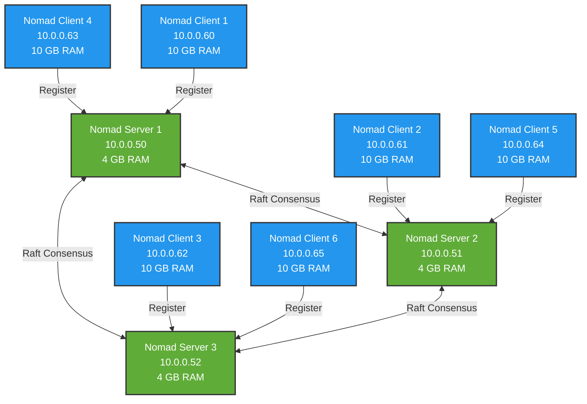
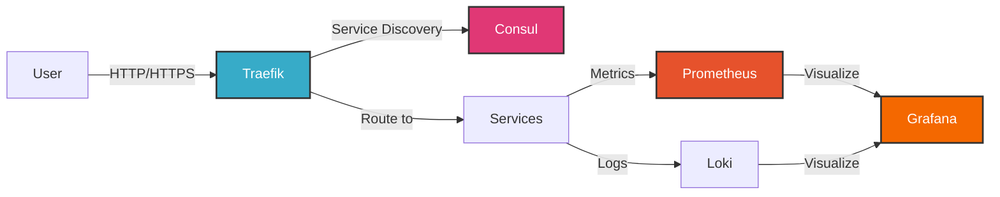
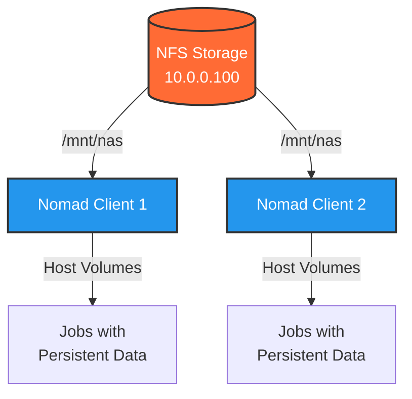

# HashiCorp Homelab on Proxmox

A production-ready infrastructure-as-code solution for deploying containerized workloads on Proxmox VE using HashiCorp Nomad. Build VM templates with Packer, deploy clusters with Terraform, configure with Ansible, and run services at scale.

> **⚠️ SECURITY NOTICE**: This project is designed for homelab and development environments. For production use, implement proper secrets management, mTLS, and security hardening.

## What You Get

This project provides everything needed to deploy a complete container orchestration platform on Proxmox:

- **Multi-node Nomad cluster** with automatic failover and scheduling
- **Service discovery** via Consul with health checking
- **Secrets management** with Vault HA cluster (optional, see Vault integration roadmap)
- **Automatic service routing** with Traefik reverse proxy
- **Metrics and monitoring** with Prometheus, Grafana, and Loki
- **Log aggregation** with Grafana Alloy and Loki
- **Docker registry** with pull-through cache for faster deployments
- **Persistent storage** using NFS mounts for high availability
- **Reproducible infrastructure** using Packer, Terraform, and Ansible
- **Configuration management** with Ansible for maintainable operations

## Features

- 🚀 **Automated VM Templates** - Packer builds optimized Debian images with HashiCorp tools pre-installed
- 🔧 **HashiCorp Stack** - Consul and Nomad configured for container orchestration
- 🐳 **Container-Native** - Docker pre-configured with Nomad driver integration and registry caching
- 🏗️ **Infrastructure as Code** - Terraform modules for repeatable multi-node deployments
- ⚙️ **Configuration Management** - Ansible roles for maintainable, idempotent configuration
- 📦 **Incremental Builds** - Templates layer on each other for fast iteration
- 🏠 **Homelab Optimized** - Efficient resource usage for multi-node Proxmox clusters
- 🌐 **Service Discovery** - Traefik with Consul Catalog for automatic routing
- 💾 **High Availability Storage** - NFS-backed volumes accessible from all nodes
- 📊 **Full Observability** - Metrics (Prometheus), logs (Loki), and dashboards (Grafana)
- 🐋 **Local Registry** - Docker Registry 2 with pull-through cache for faster image pulls
- 🤖 **AI Integration** - MCP server for managing Nomad clusters through AI assistants
- 🔐 **Remote Access** - Tailscale VPN for secure access to homelab services from anywhere

## Architecture

This project deploys a multi-tier HashiCorp stack on Proxmox VE.

### Cluster Topology



### Service Flow



### Storage Architecture



**Key Components:**

- **Nomad Servers (3)**: Manage cluster state, scheduling decisions, and job placement using Raft consensus
- **Nomad Clients (6)**: Run containerized workloads with Docker driver
- **Consul**: Service discovery, health checking, and KV store (co-located with Nomad servers)
- **Traefik**: Reverse proxy with automatic service registration via Consul catalog
- **Observability Stack**: Prometheus (metrics), Loki (logs), Grafana (visualization), Alloy (collection)
- **Storage**: NFS mounts from NAS provide persistent storage via host volumes

**Current Resource Allocation:**

| Component | Count | vCPU | Memory | Notes |
|-----------|-------|------|--------|-------|
| Nomad Servers | 3 | 2 | 4 GB | Consul co-located |
| Nomad Clients | 6 | 4 | 10 GB | Docker + workloads |
| Vault Hubs (optional) | 3 | 2 | 2 GB | HA cluster |
| **Total** | **9-12** | **32-38** | **72-78 GB** | **~75% utilization** |

**Container Memory Usage:** ~13.6 GB across 28+ services  
**Optimization History:** See [RESOURCE_SURVEY.md](docs/RESOURCE_SURVEY.md)

## Quick Start

### Prerequisites

**Hardware:**

- Proxmox VE 7.x or later (tested on 8.x and 9.x)
- At least 3 Proxmox nodes for HA (or 1 node for testing)
- Network with DHCP for VM provisioning
- Static IP range available for cluster nodes

**Software (local machine):**

- [Packer](https://www.packer.io/) 1.9.x or later
- [Terraform](https://www.terraform.io/) 1.5.x or later  
- [Task](https://taskfile.dev/) (optional, recommended for simplified workflows)
- SSH access to Proxmox API

**Optional:**

- NFS storage server for persistent volumes
- Local DNS server for custom domain names

### Installation

#### 1. Clone and Configure

```bash
git clone https://github.com/jharter1/hashi_homelab.git
cd hashi_homelab

# Set your Proxmox credentials
# Bash/Zsh:
export PROXMOX_PASSWORD="your-password"

# Fish:
set -x PROXMOX_PASSWORD "your-password"

# Edit Packer variables
nano packer/variables/proxmox-host1.pkrvars.hcl
# Update: proxmox_host, proxmox_node, storage_pool, network_bridge

# Edit Terraform variables  
nano terraform/environments/dev/terraform.tfvars
# Update: proxmox_host, proxmox_nodes, IP ranges, cluster size
```

#### 2. Build VM Templates with Packer

Note: this takes a long time (20+ minutes per template image), or at least it did with the mini PCs I was working with. Your mileage may vary.

```bash
# Using Task (recommended)
task build:debian:base      # Base Debian cloud image
task build:debian:server    # Nomad server template
task build:debian:client    # Nomad client template

# Or manually
cd packer
packer build \
  -var-file="variables/common.pkrvars.hcl" \
  -var-file="variables/proxmox-host1.pkrvars.hcl" \
  -var="proxmox_password=${PROXMOX_PASSWORD}" \
  templates/debian/debian-nomad-server.pkr.hcl
```

This creates optimized VM templates with HashiCorp tools pre-installed.

#### 3. Deploy Cluster with Terraform

```bash
# Using Task
task tf:apply

# Or manually
cd terraform/environments/dev
terraform init
terraform plan -out=tfplan
terraform apply tfplan
```

This provisions:
- 3 Nomad servers with Consul
- 6 Nomad clients with Docker
- All networking and VM configuration
- NFS mounts for shared storage

#### 4. Configure Nodes with Ansible

After VMs boot, configure all services with Ansible:

```bash
# Using Task
task ansible:configure

# Or manually
cd ansible
ansible-playbook playbooks/site.yml
```

This configures:
- Docker daemon with registry mirror
- Nomad client configuration and host volumes
- NFS mounts and base system packages
- DNS and networking

#### 5. Deploy Services

```bash
# Deploy everything
task deploy:all

# Or deploy individually
task deploy:system    # Traefik, Alloy
task deploy:services  # Monitoring stack, registry, apps

# Or manually
export NOMAD_ADDR=http://10.0.0.50:4646
nomad job run jobs/system/traefik.nomad.hcl
nomad job run jobs/services/grafana.nomad.hcl
```

### 🚀 Bootstrap from Scratch

#### Prerequisites Check

Validate your environment before running the full bootstrap:

```bash
task bootstrap:check
```

This verifies:
- Packer templates exist on Proxmox (9500, 9501)
- Terraform configuration is valid
- Ansible can reach nodes (or confirms they don't exist yet)

#### Full Bootstrap

Run the complete setup in one command:

```bash
task bootstrap
```

This executes all steps:
1. Verifies Packer templates exist (requires DNS on Proxmox for initial creation)
2. Provisions VMs with Terraform (9 VMs: 3 servers, 6 clients)
3. Waits for VMs to boot (60 seconds)
4. Configures nodes with Ansible (Docker, Nomad, NFS, etc.)
5. Deploys all Nomad jobs (Traefik, monitoring, registry, apps)

Total time: ~10-15 minutes (assuming templates already exist)

**Note**: Initial Packer template creation requires ~45-60 minutes and DNS resolution on the Proxmox host. Once templates are created, subsequent bootstraps are much faster.

#### 6. Verify Deployment

```bash
# SSH to any server
ssh ubuntu@10.0.0.50

# Check cluster health
consul members
nomad server members
nomad node status

# View deployed jobs
nomad job status
```

### Access Your Services

After deployment, access the web interfaces:

- **Nomad UI**: `http://10.0.0.50:4646`
- **Consul UI**: `http://10.0.0.50:8500`
- **Grafana**: `http://grafana.home` (add to /etc/hosts or use Traefik IP)
- **Prometheus**: `http://prometheus.home`
- **Docker Registry UI**: `http://registry-ui.home`
- **Traefik Dashboard**: `http://traefik.home`

See the [example services](jobs/) directory for reference implementations.

## AI Integration (MCP Servers)

Interact with your entire homelab infrastructure through AI assistants using Model Context Protocol (MCP) servers.

### Available MCP Servers

We provide **7 MCP servers** with **50 tools** for managing your infrastructure:

- **Nomad** - Job and cluster management (8 tools)
- **Consul** - Service discovery and KV store (7 tools)
- **Vault** - Secrets management (7 tools)
- **Terraform** - Infrastructure inspection (6 tools)
- **Ansible** - Automation inspection (7 tools)
- **Proxmox** - Virtualization management (7 tools)
- **Traefik** - Reverse proxy and routing (8 tools)

### Quick Setup

```bash
# Build all MCP servers
task mcp:build:all

# Or build individually
task mcp:build:nomad
task mcp:build:consul
task mcp:build:vault
# ... etc
```

### Configure Your AI Assistant

Add to your MCP settings:

```json
{
  "mcpServers": {
    "nomad": {
      "command": "node",
      "args": [
        "/Users/jackharter/Developer/hashi_homelab/mcp-servers/nomad/dist/index.js"
      ],
      "env": {
        "NOMAD_ADDR": "http://10.0.0.50:4646"
      }
    }
  }
}
```

Then ask your AI:

- "What jobs are running in Nomad?"
- "Show me the status of the grafana job"
- "Get logs from the prometheus allocation"
- "Is my Nomad cluster healthy?"
- "List all services in Consul"
- "What VMs are running on Proxmox?"
- "What routers are configured in Traefik?"

**See [mcp-servers/MCP_QUICK_REFERENCE.md](mcp-servers/MCP_QUICK_REFERENCE.md) for complete configuration and all 50 available tools.**
- **Docker Registry UI**: `http://registry-ui.home`
- **Traefik Dashboard**: `http://traefik.home`

See the [example services](jobs/) directory for reference implementations.

## Vault Integration (Optional)

This project includes infrastructure for a dedicated 3-node Vault HA cluster for secrets management.

### Quick Start

```bash
# Deploy complete Vault cluster
task vault:deploy:full

# Check cluster status
task vault:status

# Test Vault
task vault:test
```

### What You Get

- 3-node Vault HA cluster (10.0.0.30-32)
- Raft integrated storage (no external dependencies)
- Consul service discovery integration
- Automated initialization and unsealing
- Ready for Nomad workload identity integration

### Documentation

- **[Vault Guide](docs/VAULT.md)** - Deployment, integration & usage guide
- **[Quick Reference](docs/CHEATSHEET.md)** - Command shortcuts for all tools
- **[Vault Integration Roadmap](ansible/TODO.md)** - Phase 2-4 implementation plan

### Current Status

- ✅ **Phase 1**: Hub cluster deployment (infrastructure ready)
- 🔄 **Phase 2**: Nomad-Vault integration (in progress, see `ansible/TODO.md`)
- 🔄 **Phase 3**: OIDC authentication (planned)
- 🔄 **Phase 4**: Production hardening (planned)

See `ansible/TODO.md` for detailed roadmap and implementation tasks.

## Remote Access with Tailscale (Optional)

Access your homelab services from anywhere using Tailscale VPN - same URLs whether you're home or remote.

### Quick Start

```bash
# Deploy on Traefik node first (recommended)
task tailscale:deploy:traefik

# Authenticate in browser when prompted
# Then approve subnet routes at https://login.tailscale.com/admin/machines

# Check status
task tailscale:status
```

### What You Get

- **Remote VPN access** to entire homelab network (10.0.0.0/24)
- **Same service URLs** - `https://*.lab.hartr.net` works from anywhere
- **Secure WireGuard tunnel** - no exposed ports required
- **SSL certificates work** - Let's Encrypt certs valid over VPN
- **Access management UIs** - Nomad, Consul, Traefik from anywhere

### Documentation

See **[docs/SERVICES.md](docs/SERVICES.md)** for complete setup guide including:
- DNS configuration options
- Subnet routing approval
- Troubleshooting
- Security recommendations

## Directory Structure

```plaintext
hashi_homelab/
├── ansible/                             # Configuration management
│   ├── inventory/
│   │   └── hosts.yml                   # All cluster nodes
│   ├── playbooks/
│   │   ├── site.yml                    # Main playbook
│   │   ├── configure-docker.yml        # Docker configuration
│   │   └── test-connectivity.yml       # Connection testing
│   ├── roles/
│   │   ├── base-system/                # DNS, NFS, packages
│   │   └── nomad-client/               # Nomad client config
│   └── README.md                        # Ansible documentation
├── jobs/
│   ├── system/                          # System jobs (run on every client)
│   │   ├── traefik.nomad.hcl           # Reverse proxy
│   │   └── alloy.nomad.hcl             # Log collection
│   └── services/                        # Service jobs
│       ├── grafana.nomad.hcl           # Visualization
│       ├── prometheus.nomad.hcl        # Metrics
│       ├── loki.nomad.hcl              # Log aggregation
│       ├── minio.nomad.hcl             # Object storage
│       └── whoami.nomad.hcl            # Test service
├── packer/
│   ├── templates/
│   │   └── debian/                      # Debian templates (primary)
│   │       ├── debian-nomad-server.pkr.hcl
│   │       └── debian-nomad-client.pkr.hcl
│   ├── scripts/
│   │   └── create-debian-cloud-base.sh  # Base image creation
│   └── variables/
│       ├── common.pkrvars.hcl           # Shared variables (versions, etc)
│       └── proxmox-host1.pkrvars.hcl   # Proxmox-specific config
├── terraform/
│   ├── environments/
│   │   └── dev/                         # Dev environment
│   │       ├── main.tf
│   │       ├── variables.tf
│   │       ├── outputs.tf
│   │       └── terraform.tfvars
│   └── modules/
│       ├── proxmox-vm/                  # Base VM module
│       ├── nomad-server/                # Nomad server cluster
│       │   └── templates/
│       │       └── server-cloud-init.yaml  # Minimal cloud-init
│       └── nomad-client/                # Nomad client nodes
│           └── templates/
│               └── client-cloud-init.yaml  # Minimal cloud-init
├── scripts/                             # Helper scripts
│   ├── set-proxmox-password.fish       # Used by Taskfile for Packer builds
│   ├── setup-vault.fish                # Vault setup automation (WIP)
│   ├── configure-vault-nomad-integration.fish  # Vault-Nomad integration (WIP)
│   └── migrate-vault-dev-to-hub.fish   # Vault migration helper (WIP)
├── docs/                                # Documentation
│   ├── SERVICES.md                     # Service deployment guides
│   └── PROMETHEUS.md                   # Prometheus monitoring guide
├── Taskfile.yml                         # Task automation
├── .gitignore                           # Excludes secrets
├── LICENSE
└── README.md                            # This file
```

## Common Operations

### Using Task (Recommended)

```bash
# Complete bootstrap from scratch
task bootstrap

# Infrastructure operations
task tf:apply                   # Provision VMs
task tf:destroy                 # Tear down VMs

# Configuration management
task ansible:configure          # Configure all nodes
task ansible:docker            # Update Docker config only
task ansible:test              # Test connectivity

# Service deployment
task deploy:all                # Deploy all jobs
task deploy:system             # Deploy system jobs only
task deploy:services           # Deploy service jobs only

# Packer builds
task build:debian:base         # Build base image
task build:debian:server       # Build server template
task build:debian:client       # Build client template
```

### Manual Operations

```bash
# Check cluster status
export NOMAD_ADDR=http://10.0.0.50:4646
nomad node status
nomad job status

# Update a job
nomad job run jobs/services/grafana.nomad.hcl

# Stop a job
nomad job stop grafana

# View logs
nomad alloc logs -f <alloc-id>

# SSH to nodes
ssh ubuntu@10.0.0.50  # Server
ssh ubuntu@10.0.0.60  # Client
```

## Prerequisites (Detailed)

### Proxmox Host Requirements

- Proxmox VE 9.x or later
- SSH access to Proxmox host
- Storage configured for VM templates
- Network bridge configured (default: vmbr0)

### Required Tools on Proxmox Host

```bash
# Install libguestfs-tools for cloud image customization
apt-get update
apt-get install -y libguestfs-tools
```

### Local Machine Requirements

- [Packer](https://www.packer.io/downloads) 1.14.x or later
- [Task](https://taskfile.dev/) (optional, but recommended for simplified builds)
- SSH access to Proxmox API
- Network connectivity to Proxmox cluster

Install Task (optional):

```bash
# macOS
brew install go-task

# Linux
sh -c "$(curl --location https://taskfile.dev/install.sh)" -- -d -b ~/.local/bin
```

## Configuration

### Packer Variables

Edit `packer/variables/proxmox-host1.pkrvars.hcl`:

```hcl
proxmox_host     = "https://10.0.0.21:8006"
proxmox_node     = "pve1"
proxmox_username = "root@pam"
proxmox_password = "SET_VIA_CLI"  # Pass via -var flag
storage_pool     = "local-lvm"
network_bridge   = "vmbr0"
```

### Terraform Variables

Edit `terraform/environments/dev/terraform.tfvars`:

```hcl
proxmox_host     = "https://your-proxmox-host:8006"
proxmox_nodes    = ["pve1", "pve2", "pve3"]
proxmox_password = ""  # Or use TF_VAR_proxmox_password env var

# DNS servers (use your local DNS for custom domains)
dns_servers = ["1.1.1.1", "8.8.8.8"]

# IP allocation (configure based on your network)
nomad_server_ip_start = 50  # First server gets .50, next .51, etc.
nomad_client_ip_start = 60  # First client gets .60, next .61, etc.

# Template IDs (must match Packer output)
nomad_server_template_name = "9100"
nomad_client_template_name = "9101"

# Cluster size (minimum 3 servers for HA, 2+ clients recommended)
nomad_server_count = 3
nomad_client_count = 2
```

### Optional: NFS Storage Configuration

For persistent volumes, configure NFS mounts in `terraform/modules/proxmox-vm/templates/configure-vm.sh.tftpl`:

```bash
# Example NFS configuration for client nodes
if [ "$ROLE" = "nomad-client" ]; then
  # Install NFS client
  apt-get install -y nfs-common
  
  # Mount NFS share
  mkdir -p /mnt/nas
  mount -t nfs your-nas-host:/export/path /mnt/nas
  echo "your-nas-host:/export/path /mnt/nas nfs defaults 0 0" >> /etc/fstab
  
  # Create service directories
  mkdir -p /mnt/nas/{service1,service2}
fi
```

## Example Services

The `jobs/` directory includes production-ready examples:

- **Traefik** (`jobs/system/traefik.nomad.hcl`) - Reverse proxy with Consul Catalog integration for automatic service discovery
- **Prometheus** (`jobs/services/prometheus.nomad.hcl`) - Metrics collection with persistent storage
- **Grafana** (`jobs/services/grafana.nomad.hcl`) - Visualization dashboards
- **MinIO** (`jobs/services/minio.nomad.hcl`) - S3-compatible object storage
- **Whoami** (`jobs/services/whoami.nomad.hcl`) - Simple test service

Each service demonstrates best practices for:

- Consul service registration and health checks
- Traefik routing with automatic discovery
- Persistent volume management
- Resource constraints and scheduling

## Deploying Services

Nomad uses HCL job specifications to define how services run:

```bash
# Deploy a single service
nomad job run jobs/services/your-service.nomad.hcl

# Check job status
nomad job status your-service

# View service logs
nomad alloc logs <allocation-id>

# Stop a service
nomad job stop your-service
```

### System Jobs vs Service Jobs

- **System jobs** (`jobs/system/`) run on every client node (like DaemonSets)
- **Service jobs** (`jobs/services/`) run on specific nodes based on constraints

Example system job candidates: Traefik, Promtail, monitoring agents, security tools.

## Multi-Node Deployment

### Step 1: Deploy on Single Node

```bash
cd terraform/environments/dev
terraform apply
```

Deploys all VMs on pve1.

### Step 2: Copy Templates to Other Nodes

```bash
# SSH to pve1
ssh root@10.0.0.21

# Clone templates to pve2
qm clone 9100 9100 --target pve2
qm clone 9101 9101 --target pve2

# Clone templates to pve3
qm clone 9100 9100 --target pve3
qm clone 9101 9101 --target pve3
```

### Step 3: Redistribute VMs

```hcl
# Edit terraform.tfvars
proxmox_nodes = ["pve1", "pve2", "pve3"]
```

```bash
terraform apply
```

Terraform will redistribute VMs across all 3 nodes.

## Troubleshooting

> **📖 For comprehensive troubleshooting, see [docs/TROUBLESHOOTING.md](docs/TROUBLESHOOTING.md)**  
> Common issues covered: Vault integration, networking, database connectivity, resource allocation, and service-specific gotchas.

### Quick Diagnostics

```bash
# Check all job statuses
nomad job status

# View allocation details
nomad alloc status <alloc-id>

# View logs (stdout and stderr)
nomad alloc logs <alloc-id>
nomad alloc logs -stderr <alloc-id>

# Check Consul service registration
consul catalog services
consul catalog service <service-name>
```

### Packer Build Fails

**SSH Timeout**:

- Verify QEMU guest agent is enabled in template
- Check `cloud-init status --wait` on VM
- Ensure network connectivity and DHCP working

**Template Not Found**:

- Verify template exists: `ssh root@proxmox "qm list | grep 9100"`
- Check template is on correct node
- Ensure VM ID matches in packer variables

### Terraform Deployment Fails

**Cannot Find Template on Node**:

- Templates must exist on each node before deployment
- Copy templates with `qm clone` (see Multi-Node Deployment)
- Or deploy all VMs on single node initially

**IP Address Conflicts**:

- Ensure IPs are outside DHCP range
- Check no existing VMs use same IPs
- Verify static IP range (10.0.0.30-99) is reserved

### Cluster Formation Issues

**Consul Members Not Joining**:

```bash
# Check Consul logs
sudo journalctl -u consul -f

# Verify retry_join IPs are correct
cat /etc/consul.d/consul.hcl

# Restart Consul
sudo systemctl restart consul
```

**Nomad Servers Not Bootstrapping**:

```bash
# Check Nomad logs
sudo journalctl -u nomad -f

# Verify server count matches bootstrap_expect
nomad server members

# Check Consul is running (Nomad depends on it)
consul members
```

### Service Deployment Issues

**Container Fails to Start (Exit Code 127)**:

This typically means the container's command or entrypoint wasn't found. Common causes:

- Docker image requires CPU features not available (e.g., x86-64-v2 instruction set)
- Incorrect command/args in job specification
- Missing executable in container

Solutions:

- Use older, more compatible image versions
- Verify the image works on your CPU: `docker run --rm [image] --version`
- Check Nomad allocation logs: `nomad alloc logs <allocation-id>`

### Quick References

- [TROUBLESHOOTING.md](docs/TROUBLESHOOTING.md) - Common issues, gotchas, and solutions
- [QUICKSTART.md](docs/QUICKSTART.md) - Fast-track deployment guide
- [CHEATSHEET.md](docs/CHEATSHEET.md) - Command reference and quick tips
- [RESOURCE_SURVEY.md](docs/RESOURCE_SURVEY.md) - Resource monitoring and optimization

### Detailed Guides

- [NEW_SERVICES_DEPLOYMENT.md](docs/NEW_SERVICES_DEPLOYMENT.md) - Service architecture and deployment patterns
- [SERVICES.md](docs/SERVICES.md) - Service-specific setup guides (Tailscale, Docker Registry, Traefik SSL, etc.)
- [INFRASTRUCTURE.md](docs/INFRASTRUCTURE.md) - Storage architecture and disk configuration
- [POSTGRESQL.md](docs/POSTGRESQL.md) - Database management (anti-pattern guide)

### Component Documentation

- [packer/templates/ubuntu/README.md](packer/templates/ubuntu/README.md) - Template details and build order
- [mcp-servers/README.md](mcp-servers/README.md) - MCP server setup for AI integration
- [ansible/roles/*/README.md](ansible/roles/) - Ansible role documentation

If services aren't accessible after deployment:

- Verify service is registered: `consul catalog services`
- Check service health: `consul catalog service <service-name>`
- For Traefik routes, verify tags: `consul catalog service <service-name> -detailed`
- Ensure DNS records point to correct nodes
- Check Traefik dashboard for registered routes

**Volume Mount Issues**:

If persistent data isn't available:

- Verify host volume exists on client: `nomad node status -verbose <node-id>`
- Check directory permissions on host
- For NFS mounts: `mount | grep nfs` and `df -h`
- Ensure volume is declared in both job spec and client configuration

## Documentation

- **packer/templates/ubuntu/README.md** - Template details and build order
- **docs/** - Additional guides and references

## Contributing

Contributions welcome! Please:

1. Fork the repository
2. Create a feature branch
3. Test changes thoroughly
4. Submit a pull request with clear description
5. Ensure no secrets are committed

## License

MIT License - See LICENSE file for details

---

**Note**: This project is designed for homelab and development environments. For production deployments, additional security hardening and testing is recommended.
