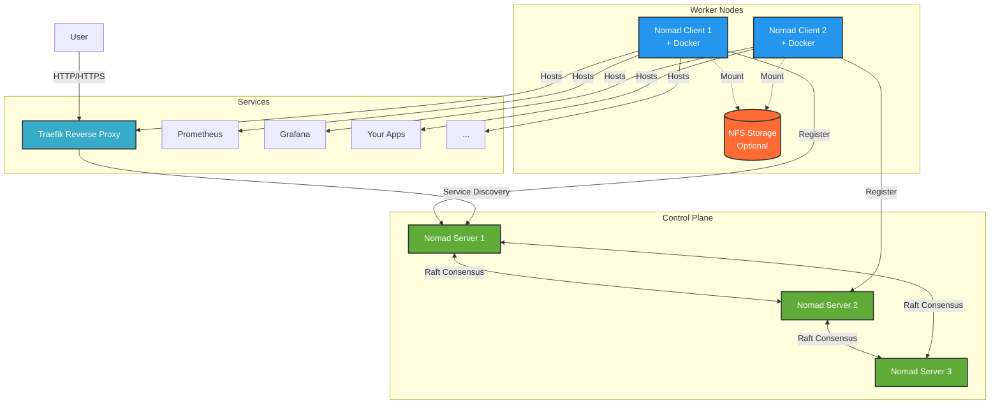

# HashiCorp Homelab on Proxmox

A production-ready infrastructure-as-code solution for deploying containerized workloads on Proxmox VE using HashiCorp Nomad. Build VM templates with Packer, deploy clusters with Terraform, and run services at scale.

> **⚠️ SECURITY NOTICE**: This project is designed for homelab and development environments. For production use, implement proper secrets management, mTLS, and security hardening.

## What You Get

This project provides everything needed to deploy a complete container orchestration platform on Proxmox:

- **Multi-node Nomad cluster** with automatic failover and scheduling
- **Service discovery** via Consul with health checking
- **Secrets management** using HashiCorp Vault
- **Automatic service routing** with Traefik reverse proxy
- **Metrics and monitoring** with Prometheus and Grafana
- **Persistent storage** supporting NFS and local volumes
- **Reproducible infrastructure** using Packer and Terraform

## Features

- 🚀 **Automated VM Templates** - Packer builds optimized Debian/Ubuntu images with HashiCorp tools pre-installed
- 🔧 **Complete HashiCorp Stack** - Consul, Nomad, and Vault configured and ready to use
- 🐳 **Container-Native** - Docker pre-configured with Nomad driver integration
- 🏗️ **Infrastructure as Code** - Terraform modules for repeatable multi-node deployments
- 📦 **Incremental Builds** - Templates layer on each other for fast iteration
- 🏠 **Homelab Optimized** - Efficient resource usage for multi-node Proxmox clusters
- 🌐 **Service Discovery** - Traefik with Consul Catalog for automatic routing
- 💾 **Flexible Storage** - Support for NFS mounts, local volumes, and CSI plugins
- 📊 **Observability Built-in** - Node Exporter on all hosts, ready for monitoring

## Architecture

This project deploys a multi-tier HashiCorp stack on Proxmox VE:



**Key Components:**

- **Nomad Servers (3+)**: Manage cluster state, scheduling decisions, and job placement
- **Nomad Clients (2+)**: Run containerized workloads with Docker driver
- **Consul**: Service discovery, health checking, and KV store (co-located with servers)
- **Vault**: Secrets management and credential issuing (co-located with servers)
- **Traefik**: Reverse proxy with automatic service registration via Consul
- **Storage**: Optional NFS mounts for persistent data across clients

## Quick Start

### Prerequisites

**Hardware:**

- Proxmox VE 7.x or later (tested on 8.x and 9.x)
- At least 3 Proxmox nodes for HA (or 1 node for testing)
- Network with DHCP for VM provisioning
- Static IP range available for cluster nodes

**Software (local machine):**

- [Packer](https://www.packer.io/) 1.9.x or later
- [Terraform](https://www.terraform.io/) 1.5.x or later  
- [Task](https://taskfile.dev/) (optional, recommended for simplified workflows)
- SSH access to Proxmox API

**Optional:**

- NFS storage server for persistent volumes
- Local DNS server for custom domain names

### Installation

#### 1. Clone and Configure

```bash
git clone https://github.com/jharter1/hashi_homelab.git
cd hashi_homelab

# Set your Proxmox credentials
# Bash/Zsh:
export PROXMOX_PASSWORD="your-password"

# Fish:
set -x PROXMOX_PASSWORD "your-password"

# Edit Packer variables
nano packer/variables/proxmox-host1.pkrvars.hcl
# Update: proxmox_host, proxmox_node, storage_pool, network_bridge

# Edit Terraform variables  
nano terraform/environments/dev/terraform.tfvars
# Update: proxmox_host, proxmox_nodes, IP ranges, cluster size
```

#### 2. Build VM Templates with Packer

Note: this takes a long time (20+ minutes per template image), or at least it did with the mini PCs I was working with. Your mileage may vary.

```bash
# Using Task (recommended)
task build:debian:server
task build:debian:client

# Or manually
cd packer
packer build \
  -var-file="variables/common.pkrvars.hcl" \
  -var-file="variables/proxmox-host1.pkrvars.hcl" \
  -var="proxmox_password=${PROXMOX_PASSWORD}" \
  templates/debian/debian-nomad-server.pkr.hcl
```

This creates optimized VM templates (IDs: 9100, 9101) with all HashiCorp tools pre-installed.

#### 3. Deploy Cluster with Terraform

```bash
cd terraform/environments/dev

terraform init
terraform plan -out=tfplan
terraform apply tfplan
```

This provisions:

- 3 Nomad servers with Consul and Vault
- 2+ Nomad clients with Docker
- All networking and firewall rules
- Automatic cluster formation

#### 4. Verify Deployment

```bash
# SSH to any server
ssh ubuntu@10.0.0.50

# Check cluster health
consul members
nomad server members
nomad node status
```

#### 5. Deploy Services

```bash
# Set Nomad address
export NOMAD_ADDR=http://10.0.0.50:4646

# Deploy example services
nomad job run jobs/system/traefik.nomad.hcl
nomad job run jobs/services/prometheus.nomad.hcl
nomad job run jobs/services/grafana.nomad.hcl

# Or use Task
task deploy
```

### Access Your Cluster

- **Nomad UI**: `http://[server-ip]:4646`
- **Consul UI**: `http://[server-ip]:8500`
- **Vault UI**: `http://[server-ip]:8200` (requires initialization)

See the [example services](jobs/) directory for reference implementations of Traefik, Prometheus, Grafana, and more.

## Directory Structure

```plaintext
hashi_homelab/
├── jobs/
│   ├── system/                          # System jobs (run on every client node)
│   │   └── traefik.nomad.hcl           # Reverse proxy with Consul Catalog
│   └── services/                        # Service jobs (run on specific nodes)
│       ├── grafana.nomad.hcl           # Visualization dashboards
│       ├── prometheus.nomad.hcl        # Metrics collection
│       ├── minio.nomad.hcl             # S3-compatible object storage
│       └── whoami.nomad.hcl            # Test service
├── packer/
│   ├── templates/
│   │   ├── debian/                      # Debian templates (currently deployed)
│   │   │   ├── debian-nomad-server.pkr.hcl
│   │   │   └── debian-nomad-client.pkr.hcl
│   │   └── ubuntu/                      # Ubuntu templates (legacy/alternative)
│   │       ├── ubuntu-bare-minimum.pkr.hcl
│   │       ├── ubuntu-qemu-agent.pkr.hcl
│   │       ├── ubuntu-consul.pkr.hcl
│   │       ├── ubuntu-nomad.pkr.hcl
│   │       ├── ubuntu-hashicorp-full.pkr.hcl
│   │       ├── ubuntu-nomad-server.pkr.hcl
│   │       ├── ubuntu-nomad-client.pkr.hcl
│   │       └── http*/                   # Cloud-init configurations
│   ├── scripts/
│   │   └── create-debian-cloud-base.sh  # Debian base image creation
│   └── variables/
│       ├── common.pkrvars.hcl           # Shared variables (versions, etc)
│       └── proxmox-host1.pkrvars.hcl   # Proxmox-specific config
├── terraform/
│   ├── environments/
│   │   └── dev/                         # Dev environment configuration
│   │       ├── main.tf
│   │       ├── variables.tf
│   │       ├── outputs.tf
│   │       └── terraform.tfvars
│   └── modules/
│       ├── proxmox-vm/                  # Base VM module
│       │   ├── main.tf
│       │   ├── variables.tf
│       │   └── templates/
│       │       └── configure-vm.sh.tftpl  # VM provisioning script
│       ├── nomad-server/                # Nomad server cluster
│       │   └── templates/
│       │       ├── consul-server.hcl
│       │       └── nomad-server.hcl
│       └── nomad-client/                # Nomad client nodes
│           └── templates/
│               ├── consul-client.hcl
│               └── nomad-client.hcl
├── docs/                                # Documentation
├── configs/                             # Example configurations
├── Taskfile.yml                         # Task automation
├── set-proxmox-password.fish           # Helper script for env vars
├── .gitignore                           # Excludes secrets
├── LICENSE
└── README.md                            # This file
```

## Prerequisites (Detailed)

### Proxmox Host Requirements

- Proxmox VE 9.x or later
- SSH access to Proxmox host
- Storage configured for VM templates
- Network bridge configured (default: vmbr0)

### Required Tools on Proxmox Host

```bash
# Install libguestfs-tools for cloud image customization
apt-get update
apt-get install -y libguestfs-tools
```

### Local Machine Requirements

- [Packer](https://www.packer.io/downloads) 1.14.x or later
- [Task](https://taskfile.dev/) (optional, but recommended for simplified builds)
- SSH access to Proxmox API
- Network connectivity to Proxmox cluster

Install Task (optional):

```bash
# macOS
brew install go-task

# Linux
sh -c "$(curl --location https://taskfile.dev/install.sh)" -- -d -b ~/.local/bin
```

## Configuration

### Packer Variables

Edit `packer/variables/proxmox-host1.pkrvars.hcl`:

```hcl
proxmox_host     = "https://10.0.0.21:8006"
proxmox_node     = "pve1"
proxmox_username = "root@pam"
proxmox_password = "SET_VIA_CLI"  # Pass via -var flag
storage_pool     = "local-lvm"
network_bridge   = "vmbr0"
```

### Terraform Variables

Edit `terraform/environments/dev/terraform.tfvars`:

```hcl
proxmox_host     = "https://your-proxmox-host:8006"
proxmox_nodes    = ["pve1", "pve2", "pve3"]
proxmox_password = ""  # Or use TF_VAR_proxmox_password env var

# DNS servers (use your local DNS for custom domains)
dns_servers = ["1.1.1.1", "8.8.8.8"]

# IP allocation (configure based on your network)
nomad_server_ip_start = 50  # First server gets .50, next .51, etc.
nomad_client_ip_start = 60  # First client gets .60, next .61, etc.

# Template IDs (must match Packer output)
nomad_server_template_name = "9100"
nomad_client_template_name = "9101"

# Cluster size (minimum 3 servers for HA, 2+ clients recommended)
nomad_server_count = 3
nomad_client_count = 2
```

### Optional: NFS Storage Configuration

For persistent volumes, configure NFS mounts in `terraform/modules/proxmox-vm/templates/configure-vm.sh.tftpl`:

```bash
# Example NFS configuration for client nodes
if [ "$ROLE" = "nomad-client" ]; then
  # Install NFS client
  apt-get install -y nfs-common
  
  # Mount NFS share
  mkdir -p /mnt/nas
  mount -t nfs your-nas-host:/export/path /mnt/nas
  echo "your-nas-host:/export/path /mnt/nas nfs defaults 0 0" >> /etc/fstab
  
  # Create service directories
  mkdir -p /mnt/nas/{service1,service2}
fi
```

## Example Services

The `jobs/` directory includes production-ready examples:

- **Traefik** (`jobs/system/traefik.nomad.hcl`) - Reverse proxy with Consul Catalog integration for automatic service discovery
- **Prometheus** (`jobs/services/prometheus.nomad.hcl`) - Metrics collection with persistent storage
- **Grafana** (`jobs/services/grafana.nomad.hcl`) - Visualization dashboards
- **MinIO** (`jobs/services/minio.nomad.hcl`) - S3-compatible object storage
- **Whoami** (`jobs/services/whoami.nomad.hcl`) - Simple test service

Each service demonstrates best practices for:

- Consul service registration and health checks
- Traefik routing with automatic discovery
- Persistent volume management
- Resource constraints and scheduling

## Deploying Services

Nomad uses HCL job specifications to define how services run:

```bash
# Deploy a single service
nomad job run jobs/services/your-service.nomad.hcl

# Check job status
nomad job status your-service

# View service logs
nomad alloc logs <allocation-id>

# Stop a service
nomad job stop your-service
```

### System Jobs vs Service Jobs

- **System jobs** (`jobs/system/`) run on every client node (like DaemonSets)
- **Service jobs** (`jobs/services/`) run on specific nodes based on constraints

Example system job candidates: Traefik, Promtail, monitoring agents, security tools.

## Multi-Node Deployment

### Step 1: Deploy on Single Node

```bash
cd terraform/environments/dev
terraform apply
```

Deploys all VMs on pve1.

### Step 2: Copy Templates to Other Nodes

```bash
# SSH to pve1
ssh root@10.0.0.21

# Clone templates to pve2
qm clone 9100 9100 --target pve2
qm clone 9101 9101 --target pve2

# Clone templates to pve3
qm clone 9100 9100 --target pve3
qm clone 9101 9101 --target pve3
```

### Step 3: Redistribute VMs

```hcl
# Edit terraform.tfvars
proxmox_nodes = ["pve1", "pve2", "pve3"]
```

```bash
terraform apply
```

Terraform will redistribute VMs across all 3 nodes.

## Troubleshooting

### Packer Build Fails

**SSH Timeout**:

- Verify QEMU guest agent is enabled in template
- Check `cloud-init status --wait` on VM
- Ensure network connectivity and DHCP working

**Template Not Found**:

- Verify template exists: `ssh root@proxmox "qm list | grep 9100"`
- Check template is on correct node
- Ensure VM ID matches in packer variables

### Terraform Deployment Fails

**Cannot Find Template on Node**:

- Templates must exist on each node before deployment
- Copy templates with `qm clone` (see Multi-Node Deployment)
- Or deploy all VMs on single node initially

**IP Address Conflicts**:

- Ensure IPs are outside DHCP range
- Check no existing VMs use same IPs
- Verify static IP range (10.0.0.30-99) is reserved

### Cluster Formation Issues

**Consul Members Not Joining**:

```bash
# Check Consul logs
sudo journalctl -u consul -f

# Verify retry_join IPs are correct
cat /etc/consul.d/consul.hcl

# Restart Consul
sudo systemctl restart consul
```

**Nomad Servers Not Bootstrapping**:

```bash
# Check Nomad logs
sudo journalctl -u nomad -f

# Verify server count matches bootstrap_expect
nomad server members

# Check Consul is running (Nomad depends on it)
consul members
```

### Service Deployment Issues

**Container Fails to Start (Exit Code 127)**:

This typically means the container's command or entrypoint wasn't found. Common causes:

- Docker image requires CPU features not available (e.g., x86-64-v2 instruction set)
- Incorrect command/args in job specification
- Missing executable in container

Solutions:

- Use older, more compatible image versions
- Verify the image works on your CPU: `docker run --rm [image] --version`
- Check Nomad allocation logs: `nomad alloc logs <allocation-id>`

**Service Not Reachable**:

If services aren't accessible after deployment:

- Verify service is registered: `consul catalog services`
- Check service health: `consul catalog service <service-name>`
- For Traefik routes, verify tags: `consul catalog service <service-name> -detailed`
- Ensure DNS records point to correct nodes
- Check Traefik dashboard for registered routes

**Volume Mount Issues**:

If persistent data isn't available:

- Verify host volume exists on client: `nomad node status -verbose <node-id>`
- Check directory permissions on host
- For NFS mounts: `mount | grep nfs` and `df -h`
- Ensure volume is declared in both job spec and client configuration

## Documentation

- **packer/templates/ubuntu/README.md** - Template details and build order
- **docs/** - Additional guides and references

## Contributing

Contributions welcome! Please:

1. Fork the repository
2. Create a feature branch
3. Test changes thoroughly
4. Submit a pull request with clear description
5. Ensure no secrets are committed

## License

MIT License - See LICENSE file for details

---

**Note**: This project is designed for homelab and development environments. For production deployments, additional security hardening and testing is recommended.
