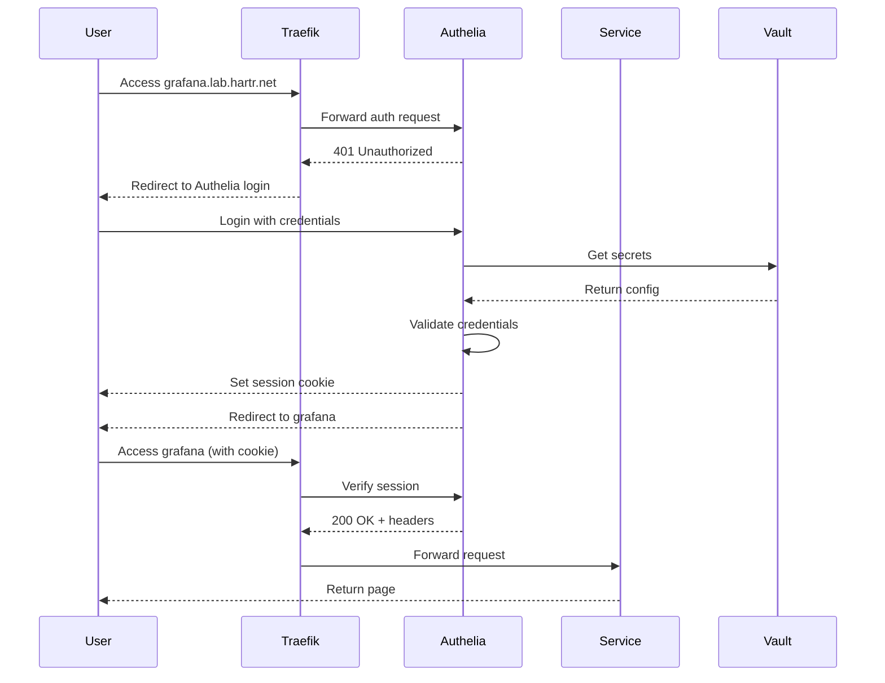

# Authelia SSO Quick Start

**🚀 Get unified authentication across all homelab services in 30 minutes**

## What You're Building

Transform this:
```
❌ Grafana → admin/admin
❌ Jenkins → separate login
❌ Gitea → different password
❌ Prometheus → no auth
```

Into this:
```
✅ All services → Single Authelia login
✅ Session persists across all apps
✅ One logout logs out everywhere
✅ 2FA option for admin tools
```

## Prerequisites

- [x] Authelia job file exists (`jobs/services/authelia.nomad.hcl`)
- [x] PostgreSQL running with authelia database
- [x] Vault accessible for secrets
- [x] Traefik exposing services via Consul Catalog

## 5-Step Quick Start

### 1. Generate Secrets (2 minutes)

```bash
export VAULT_ADDR=http://10.0.0.30:8200

vault kv put secret/authelia/config \
  jwt_secret="$(openssl rand -base64 48)" \
  session_secret="$(openssl rand -base64 48)" \
  encryption_key="$(openssl rand -base64 32)"
```

### 2. Create Your Password Hash (1 minute)

```bash
docker run --rm -it authelia/authelia:latest \
  authelia crypto hash generate argon2 --password 'YourStrongPassword123!'

# Copy the $argon2id$... output
```

### 3. Update Authelia Configuration (5 minutes)

See the full updated `authelia.nomad.hcl` in [AUTHELIA_SSO_SETUP.md](AUTHELIA_SSO_SETUP.md) Phase 3.

Key changes needed:
- Add Vault integration for secrets
- Update users_database.yml with your password hash
- Configure access control rules
- Add ForwardAuth middleware tags

### 4. Deploy Authelia (2 minutes)

```bash
# Deploy
nomad job run jobs/services/authelia.nomad.hcl

# Verify
nomad job status authelia
curl -I https://authelia.lab.hartr.net/api/health
```

### 5. Protect Your First Service (5 minutes)

Edit any service file (e.g., `jobs/services/grafana.nomad.hcl`) and add ONE line:

```hcl
tags = [
  "traefik.enable=true",
  "traefik.http.routers.grafana.rule=Host(`grafana.lab.hartr.net`)",
  "traefik.http.routers.grafana.entrypoints=websecure",
  "traefik.http.routers.grafana.tls=true",
  "traefik.http.routers.grafana.tls.certresolver=letsencrypt",
  # ⬇️ ADD THIS ⬇️
  "traefik.http.routers.grafana.middlewares=authelia@consulcatalog",
]
```

```bash
# Redeploy
nomad job run jobs/services/grafana.nomad.hcl

# Test (should redirect to Authelia)
open https://grafana.lab.hartr.net
```

## How It Works



## What Services to Protect

**Start with these** (Tier 1 - Infrastructure):
1. ✅ Grafana - `grafana.nomad.hcl`
2. ✅ Prometheus - `prometheus.nomad.hcl`
3. ✅ Traefik Dashboard - `traefik.nomad.hcl`

**Then these** (Tier 2 - Development):
4. ✅ Jenkins - `jenkins.nomad.hcl`
5. ✅ Gitea - `gitea.nomad.hcl`
6. ✅ Code Server - `codeserver.nomad.hcl`

**Finally** (Tier 3 - Personal):
7. ✅ Nextcloud - `nextcloud.nomad.hcl`
8. ✅ Calibre - `calibre.nomad.hcl`
9. ✅ Others as needed

**Keep public** (No auth):
- ❌ Homepage - main landing page
- ❌ Whoami - test service
- ❌ Docker Registry API - needed for `docker pull`
- ❌ MinIO S3 API - service-to-service communication

## Testing Checklist

After deploying Authelia:

```bash
# 1. Authelia is accessible
curl -I https://authelia.lab.hartr.net
# → HTTP/2 200

# 2. Login page loads
open https://authelia.lab.hartr.net
# → See login form

# 3. Protected service redirects
curl -I https://grafana.lab.hartr.net
# → HTTP/2 302
# → Location: https://authelia.lab.hartr.net/?rd=...

# 4. Login works
# → Enter username: jack
# → Enter password: YourPassword
# → Redirects to grafana
# → Grafana loads successfully

# 5. Session persists
# → Visit prometheus.lab.hartr.net
# → Should NOT ask for login (same session)

# 6. Logout works
# → Click logout in Authelia
# → Revisit grafana
# → Should redirect to login again
```

## Common Issues

**Issue**: Login loop (keeps redirecting to login)

```bash
# Check Redis is running
consul catalog service redis

# Check session domain matches
nomad alloc logs $(nomad job allocs authelia | grep running | awk '{print $1}' | head -1) | grep session.domain
```

**Issue**: 502 Bad Gateway

```bash
# Verify Authelia registered in Consul
consul catalog service authelia

# Test Authelia endpoint
curl http://authelia.service.consul:9091/api/health
```

**Issue**: Access Denied after login

```bash
# Check access control rules
# User's group must match the rule's subject
# Edit users_database.yml to add user to correct group
```

## Next Steps

1. **Add more users**: Edit users_database.yml, generate password hashes
2. **Enable 2FA**: Login → Settings → Security → Register OTP device
3. **Protect more services**: Add middleware tag to all job files
4. **Setup email notifications**: Configure SMTP in Authelia config
5. **Monitor auth activity**: Check Authelia logs for login attempts

## Documentation

- **[AUTHELIA_SSO_SETUP.md](AUTHELIA_SSO_SETUP.md)** - Complete configuration guide
- **[AUTHELIA_SSO_IMPLEMENTATION.md](AUTHELIA_SSO_IMPLEMENTATION.md)** - Step-by-step commands
- **[AUTHELIA_PROTECTION_EXAMPLES.md](AUTHELIA_PROTECTION_EXAMPLES.md)** - Before/after examples

## Advanced Features

**Available after basic setup**:
- 🔐 Two-factor authentication (TOTP)
- 👥 Group-based access control
- 📧 Email notifications for security events
- 🔄 Password reset flows
- 📊 Login attempt monitoring
- 🌐 LDAP/Active Directory integration
- 🎯 Per-service authorization rules

## Architecture Benefits

**Single Sign-On (SSO)**:
- Login once, access all services
- Centralized user management
- Unified session across apps

**Security**:
- Argon2id password hashing
- Session-based authentication
- Failed login protection (rate limiting)
- Optional 2FA for admin tools

**User Experience**:
- One password to remember
- Persistent sessions (configurable)
- Clean redirect flow
- Mobile-friendly login page

## Estimated Times

- **Basic Setup**: 30 minutes
- **Protect 5 services**: +15 minutes
- **Protect all services**: +30 minutes
- **Enable 2FA**: +5 minutes per user
- **Setup email**: +15 minutes

**Total to full SSO**: ~1-2 hours

---

**Ready to start?** → [AUTHELIA_SSO_IMPLEMENTATION.md](AUTHELIA_SSO_IMPLEMENTATION.md)

**Need examples?** → [AUTHELIA_PROTECTION_EXAMPLES.md](AUTHELIA_PROTECTION_EXAMPLES.md)

**Want deep dive?** → [AUTHELIA_SSO_SETUP.md](AUTHELIA_SSO_SETUP.md)
